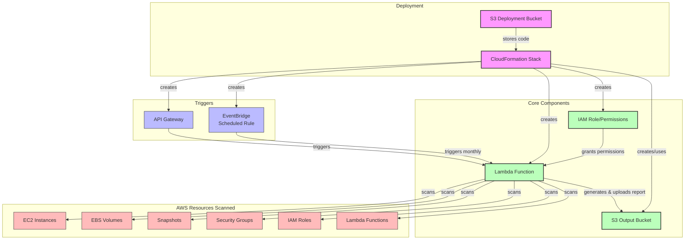
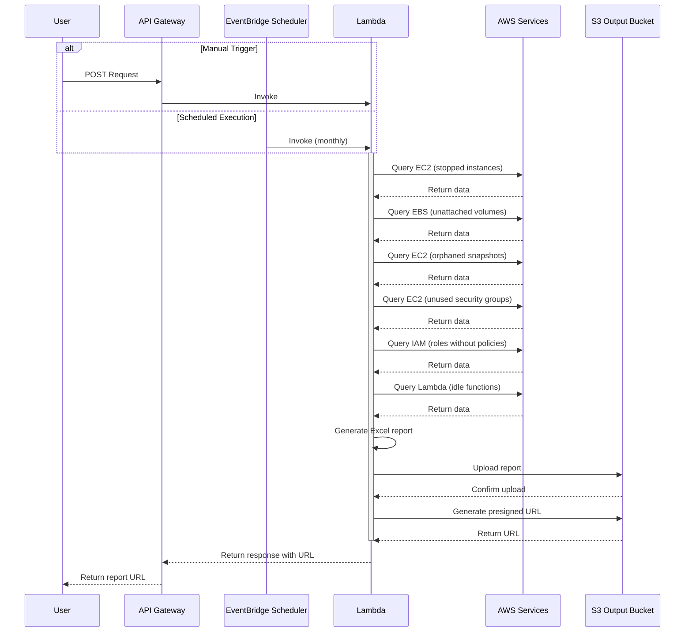

# Idle Resource Detection - Architecture

This document describes the architecture and workflow of the Idle Resource Detection system.

## System Components

## Execution Flow

## Architecture Description

The Idle Resource Detection system consists of the following components:

1. **CloudFormation Stack**: Defines and provisions all required AWS resources.

2. **Triggers**:
   - **API Gateway**: Provides an HTTP endpoint for on-demand execution
   - **EventBridge Rule**: Schedules automated monthly executions

3. **Core Components**:
   - **Lambda Function**: The main component that scans AWS resources and generates reports
   - **IAM Role**: Grants the Lambda function necessary permissions
   - **S3 Output Bucket**: Stores the generated Excel reports

4. **Resources Scanned**:
   - **EC2 Instances**: Identifies stopped instances
   - **EBS Volumes**: Identifies unattached volumes
   - **EBS Snapshots**: Identifies orphaned/expired snapshots
   - **Security Groups**: Identifies unused security groups
   - **IAM Roles**: Identifies roles without attached policies
   - **Lambda Functions**: Identifies idle Lambda functions

## Data Flow

1. The system is triggered either manually via API Gateway or on schedule via EventBridge.
2. The Lambda function queries various AWS services to identify idle resources.
3. The function compiles results into an Excel workbook with separate sheets for each resource type.
4. The report is uploaded to the S3 bucket with a timestamped filename.
5. A presigned URL is generated for easy access to the report.
6. The Lambda function returns a response with resource counts and the download URL.

This architecture provides a serverless, cost-effective solution for identifying idle AWS resources that can potentially be eliminated to reduce costs.
