# 🔄 EC2 Backup Automation - Detailed Workflow

## 📋 Architecture Overview

The EC2 Backup Automation solution follows a **13-step workflow** that leverages AWS native services for comprehensive, secure, and automated backup operations.

---

## 🎯 Step-by-Step Workflow

### 1️⃣ **Script Execution** 
**Component**: DevOps Engineer  
**Action**: Executes the bash script  
**Command**: `./start-ec2-backup.sh`

```bash
# Engineer initiates the backup process
bash start-ec2-backup.sh
```

### 2️⃣ **Instance ID Collection**
**Component**: CSV File Reader  
**Action**: Reads EC2 instance IDs from CSV  
**File**: `ec2_instances.csv`

```csv
instance_id
i-022bf7d6ddcf31ddc
i-0b19d4e150c8fca6e
```

### 3️⃣ **AWS Authentication**
**Component**: AWS CLI  
**Action**: Authenticates with AWS services  
**Verification**: Checks credentials and permissions

```bash
# Script validates AWS credentials
aws sts get-caller-identity
```

### 4️⃣ **Instance Validation**
**Component**: EC2 Service  
**Action**: Validates instance existence and state  
**Check**: Confirms instances are accessible and their current state

```bash
# Validates each EC2 instance
aws ec2 describe-instances --instance-ids i-022bf7d6ddcf31ddc
```

### 5️⃣ **Volume Discovery**
**Component**: EBS Service  
**Action**: Automatically discovers all attached volumes  
**Scope**: Includes root volume and all additional EBS volumes

```bash
# All attached volumes are automatically included
# Root volume: /dev/sda1 or /dev/xvda
# Additional volumes: /dev/sdf, /dev/sdg, etc.
```

### 6️⃣ **Backup Job Initiation**
**Component**: AWS Backup Service  
**Action**: Creates backup job for each EC2 instance  
**Process**: Initiates comprehensive backup process

```bash
# Backup job creation
aws backup start-backup-job \
  --backup-vault-name "EC2-Backup" \
  --resource-arn "arn:aws:ec2:region:account:instance/i-xxx" \
  --iam-role-arn "arn:aws:iam::account:role/AWSBackupDefaultServiceRole"
```

### 7️⃣ **IAM Role Assumption**
**Component**: IAM Service  
**Action**: Assumes service role for backup operations  
**Role**: `AWSBackupDefaultServiceRole`

```json
{
  "Version": "2012-10-17",
  "Statement": [
    {
      "Effect": "Allow",
      "Principal": {
        "Service": "backup.amazonaws.com"
      },
      "Action": "sts:AssumeRole"
    }
  ]
}
```

### 8️⃣ **Backup Storage**
**Component**: Backup Vault  
**Action**: Stores backup data securely  
**Vault**: `EC2-Backup`

```bash
# Backup vault configuration
aws backup describe-backup-vault --backup-vault-name "EC2-Backup"
```

### 9️⃣ **Data Encryption**
**Component**: AWS KMS  
**Action**: Encrypts backup data at rest  
**Security**: Uses customer-managed or AWS-managed keys

```bash
# Encryption is applied automatically
# Data is encrypted using AES-256 encryption
```

### 🔟 **Progress Monitoring**
**Component**: CloudWatch  
**Action**: Monitors backup job progress  
**Metrics**: Tracks backup status, duration, and success rates

```bash
# Monitor backup jobs
aws backup list-backup-jobs --by-backup-vault-name "EC2-Backup"
```

### 1️⃣1️⃣ **Audit Logging**
**Component**: CloudTrail  
**Action**: Logs all API calls for compliance  
**Scope**: Captures all backup-related API activities

```json
{
  "eventName": "StartBackupJob",
  "sourceIPAddress": "xxx.xxx.xxx.xxx",
  "userIdentity": {
    "type": "AssumedRole",
    "principalId": "AIDACKCEVSQ6C2EXAMPLE"
  }
}
```

### 1️⃣2️⃣ **Recovery Point Creation**
**Component**: AWS Backup  
**Action**: Creates point-in-time recovery points  
**Capability**: Enables granular restore operations

```bash
# Recovery points are automatically created
# Each backup creates a recovery point with timestamp
```

### 1️⃣3️⃣ **Local Logging**
**Component**: Local File System  
**Action**: Creates detailed execution logs  
**File**: `backup_log_YYYY-MM-DD_HH:MM:SS.log`

```bash
[2025-07-18 21:10:45] ==== Starting EC2 Backup Process ====
[2025-07-18 21:10:49] ✅ Prerequisites check passed
[2025-07-18 21:10:56] ✅ Backup job started successfully
```

---

## 🔄 Data Flow Summary

```mermaid
graph TD
    A[👨‍💻 DevOps Engineer] --> B[📝 Bash Script]
    B --> C[📊 CSV File]
    B --> D[⚙️ AWS CLI]
    D --> E[🖥️ EC2 Instances]
    E --> F[💾 EBS Volumes]
    F --> G[🔄 AWS Backup]
    G --> H[🔐 IAM Role]
    G --> I[🏦 Backup Vault]
    I --> J[🔒 KMS Encryption]
    I --> K[📊 CloudWatch]
    K --> L[🔍 CloudTrail]
    I --> M[⏰ Recovery Points]
    B --> N[📋 Local Logs]
```



---

## 🎯 Key Components Interaction

### **Security Layer**
- **IAM Roles**: Control access and permissions
- **KMS Encryption**: Protect data at rest
- **CloudTrail**: Audit all activities

### **Monitoring Layer**
- **CloudWatch**: Real-time monitoring
- **Local Logs**: Detailed execution tracking
- **Recovery Points**: Backup verification

### **Storage Layer**
- **Backup Vault**: Centralized storage
- **EBS Volumes**: Source data
- **Recovery Points**: Restore capabilities

---

## 🚀 Workflow Benefits

| Benefit | Description | Impact |
|---------|-------------|---------|
| **🔄 Automation** | Eliminates manual backup processes | ⏰ **Time Savings** |
| **🛡️ Security** | Enterprise-grade encryption and access control | 🔒 **Data Protection** |
| **📊 Monitoring** | Real-time tracking and reporting | 👀 **Visibility** |
| **⏰ Recovery** | Point-in-time restore capabilities | 🔄 **Business Continuity** |
| **🏷️ Tagging** | Automated backup identification | 📋 **Organization** |

---

## 🔧 Technical Implementation

### **Prerequisites Validation**
```bash
# Script validates all prerequisites
✅ AWS CLI installation
✅ AWS credentials configuration
✅ Backup vault existence
✅ IAM role permissions
```

### **Error Handling**
```bash
# Comprehensive error handling
❌ Invalid instance IDs
❌ Authentication failures
❌ Permission errors
❌ Vault access issues
```

### **Success Indicators**
```bash
# Success verification
✅ Backup job ID generated
✅ Recovery point created
✅ Logs written successfully
✅ Metrics updated
```

---

## 📈 Performance Metrics

### **Backup Statistics**
- **Total Instances**: Processed count
- **Success Rate**: Percentage of successful backups
- **Execution Time**: Total workflow duration
- **Error Rate**: Failed backup percentage

### **Resource Utilization**
- **API Calls**: Number of AWS API requests
- **Data Transfer**: Volume of data backed up
- **Storage Usage**: Backup vault utilization

---

*🎯 This workflow ensures comprehensive, secure, and automated EC2 backup operations using AWS native services.*
