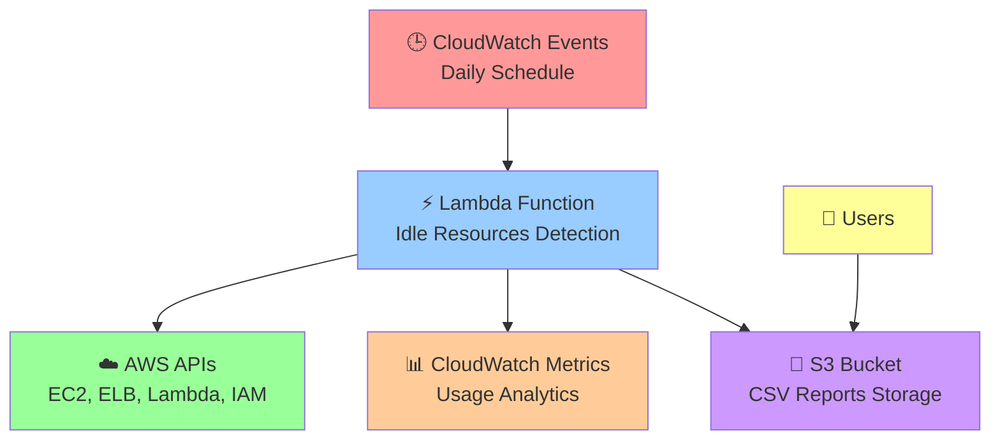

# 🔍 AWS Idle Resources Detection System

<div align="center">
  


*Automatically detect and report idle AWS resources to optimize your cloud costs* 💰

</div>

---

## 📋 Table of Contents

- [🎯 Overview](#-overview)
- [✨ Features](#-features)
- [🏗️ Architecture](#️-architecture)
- [📋 Prerequisites](#-prerequisites)
- [🚀 Getting Started](#-getting-started)
- [📊 Resources Detected](#-resources-detected)
- [⚙️ Configuration](#️-configuration)
- [📈 Monitoring](#-monitoring)
- [🛠️ Troubleshooting](#️-troubleshooting)
- [💡 Best Practices](#-best-practices)
- [🤝 Contributing](#-contributing)
- [📄 License](#-license)

---

## 🎯 Overview

The **AWS Idle Resources Detection System** is an automated solution that helps organizations identify and report unused or idle AWS resources across their infrastructure. This system runs on a daily schedule and generates comprehensive CSV reports stored in S3, enabling cost optimization and resource management.

### 🌟 Key Benefits

- 💰 **Cost Optimization**: Identify resources that can be terminated to reduce costs
- 🔍 **Comprehensive Scanning**: Detects multiple types of idle resources
- 📊 **Automated Reporting**: Daily reports with detailed findings
- ⚡ **Serverless Architecture**: Low operational overhead
- 🔒 **Secure**: Follows AWS security best practices

---

## ✨ Features

### 🔍 Resource Detection Capabilities

| Resource Type | Detection Method | Criteria |
|---------------|------------------|----------|
| 🖥️ **EC2 Instances** | Instance state | Stopped instances |
| 💾 **EBS Volumes** | Attachment status | Unattached/available volumes |
| 📸 **EBS Snapshots** | Age & AMI association | >30 days old, not used by AMIs |
| ⚖️ **Load Balancers** | CloudWatch metrics | No traffic for 7+ days |
| 🛡️ **Security Groups** | Usage analysis | Not attached to any resources |
| 🌐 **Elastic IPs** | Association status | Unassociated addresses |
| ⚡ **Lambda Functions** | Invocation metrics | No invocations for 30+ days |
| 👤 **IAM Roles** | Policy attachment | Roles without attached policies |

### 📋 Report Features

- 📊 **CSV Format**: Easy to import into spreadsheets
- 📅 **Timestamped**: Daily reports with date/time stamps
- 📝 **Detailed Information**: Comprehensive resource metadata
- 🗄️ **S3 Storage**: Secure cloud storage with lifecycle management
- 🔄 **Automated Cleanup**: 90-day retention policy

---

## 🏗️ Architecture



---

## 📋 Prerequisites

### 🔧 Technical Requirements

- ✅ **AWS Account** with administrative privileges
- ✅ **AWS CLI** installed and configured
- ✅ **Python 3.9+** (for local development)
- ✅ **CloudFormation** deployment experience

### 🔑 Required AWS Permissions

The solution requires the following IAM permissions:

#### 🔍 Read Permissions
```json
{
  "ec2:DescribeInstances",
  "ec2:DescribeVolumes", 
  "ec2:DescribeSnapshots",
  "ec2:DescribeImages",
  "ec2:DescribeSecurityGroups",
  "ec2:DescribeNetworkInterfaces",
  "ec2:DescribeAddresses",
  "elasticloadbalancing:DescribeLoadBalancers",
  "elasticloadbalancing:DescribeTargetGroups",
  "elasticloadbalancing:DescribeTargetHealth",
  "lambda:ListFunctions",
  "lambda:GetFunction",
  "lambda:GetFunctionConfiguration",
  "iam:ListRoles",
  "iam:ListAttachedRolePolicies",
  "cloudwatch:GetMetricStatistics"
}
```

#### 📝 Write Permissions
```json
{
  "s3:PutObject",
  "s3:GetObject"
}
```

### 🌍 Supported AWS Regions

- 🇺🇸 **US East (N. Virginia)** - `us-east-1`
- 🇺🇸 **US East (Ohio)** - `us-east-2`
- 🇺🇸 **US West (N. California)** - `us-west-1`
- 🇺🇸 **US West (Oregon)** - `us-west-2`
- 🇨🇦 **Canada (Central)** - `ca-central-1`
- 🇪🇺 **Europe (Ireland)** - `eu-west-1`
- 🇪🇺 **Europe (London)** - `eu-west-2`
- 🇪🇺 **Europe (Paris)** - `eu-west-3`
- 🇪🇺 **Europe (Frankfurt)** - `eu-central-1`
- 🇸🇬 **Asia Pacific (Singapore)** - `ap-southeast-1`
- 🇦🇺 **Asia Pacific (Sydney)** - `ap-southeast-2`
- 🇯🇵 **Asia Pacific (Tokyo)** - `ap-northeast-1`
- 🇰🇷 **Asia Pacific (Seoul)** - `ap-northeast-2`
- 🇮🇳 **Asia Pacific (Mumbai)** - `ap-south-1`
- 🇧🇷 **South America (São Paulo)** - `sa-east-1`

---

## 🚀 Getting Started

### Step 1: 📥 Clone or Download

```bash
# Clone the repository
git clone <repository-url>
cd aws-idle-resources-detection

# Or download the files manually
# - idle_resources_stack.yaml
# - idle_resources_lambda.py (optional - code is embedded in template)
```

### Step 2: 🔧 Configure AWS CLI

```bash
# Configure AWS CLI with your credentials
aws configure

# Verify configuration
aws sts get-caller-identity
```

### Step 3: 📋 Review CloudFormation Template

Open `idle_resources_stack.yaml` and review the parameters:

```yaml
Parameters:
  AWSRegion:
    Type: String
    Default: us-east-1  # 👈 Change this to your preferred region
```

### Step 4: 🚀 Deploy CloudFormation Stack

#### Option A: Using AWS CLI 💻

```bash
# Deploy the stack
aws cloudformation create-stack \
    --stack-name idle-resources-detection \
    --template-body file://idle_resources_stack.yaml \
    --parameters ParameterKey=AWSRegion,ParameterValue=us-east-1 \
    --capabilities CAPABILITY_IAM \
    --region us-east-1

# Monitor deployment
aws cloudformation describe-stacks \
    --stack-name idle-resources-detection \
    --region us-east-1 \
    --query 'Stacks[0].StackStatus'
```

#### Option B: Using AWS Console 🖱️

1. 🌐 Open [AWS CloudFormation Console](https://console.aws.amazon.com/cloudformation/)
2. ➕ Click **"Create stack"** → **"With new resources"**
3. 📁 Choose **"Upload a template file"**
4. 📤 Upload `idle_resources_stack.yaml`
5. 📝 Enter stack name: `idle-resources-detection`
6. ⚙️ Configure parameters (select your region)
7. ✅ Acknowledge IAM resource creation
8. 🚀 Click **"Create stack"**

### Step 5: ✅ Verify Deployment

Check that all resources were created successfully:

```bash
# Check stack status
aws cloudformation describe-stacks \
    --stack-name idle-resources-detection \
    --region us-east-1

# List created resources
aws cloudformation describe-stack-resources \
    --stack-name idle-resources-detection \
    --region us-east-1
```

### Step 6: 🧪 Test the Lambda Function

#### Manual Test 🖱️

```bash
# Get the Lambda function name
FUNCTION_NAME=$(aws cloudformation describe-stacks \
    --stack-name idle-resources-detection \
    --region us-east-1 \
    --query 'Stacks[0].Outputs[?OutputKey==`LambdaFunction`].OutputValue' \
    --output text)

# Invoke the function manually
aws lambda invoke \
    --function-name $FUNCTION_NAME \
    --region us-east-1 \
    --payload '{}' \
    response.json

# Check the response
cat response.json
```

### Step 7: 📊 Access Reports

After the function runs, check your S3 bucket:

```bash
# Get bucket name
BUCKET_NAME=$(aws cloudformation describe-stacks \
    --stack-name idle-resources-detection \
    --region us-east-1 \
    --query 'Stacks[0].Outputs[?OutputKey==`S3BucketName`].OutputValue' \
    --output text)

# List reports
aws s3 ls s3://$BUCKET_NAME/

# Download latest report
aws s3 cp s3://$BUCKET_NAME/ . --recursive
```

---

## 📊 Resources Detected

### 🖥️ EC2 Instances
- **Status**: Stopped instances
- **Information**: Instance ID, Name tag, Stop date
- **Action**: Consider terminating if no longer needed

### 💾 EBS Volumes
- **Status**: Available (unattached) volumes
- **Information**: Volume ID, Size, Type, Creation date
- **Action**: Delete unused volumes to save costs

### 📸 EBS Snapshots
- **Status**: Snapshots older than 30 days not used by AMIs
- **Information**: Snapshot ID, Size, Description, Creation date
- **Action**: Review and delete unnecessary snapshots

### ⚖️ Load Balancers
- **Classic ELB**: No requests for 7+ days
- **Application/Network LB**: No traffic or healthy targets
- **Information**: Name, DNS, ARN, Idle duration
- **Action**: Remove unused load balancers

### 🛡️ Security Groups
- **Status**: Not attached to any EC2 instances or network interfaces
- **Information**: Group ID, Name, Description
- **Action**: Delete unused security groups (except default)

### 🌐 Elastic IPs
- **Status**: Unassociated elastic IP addresses
- **Information**: Allocation ID, Public IP
- **Action**: Release unused IPs to avoid charges

### ⚡ Lambda Functions
- **Status**: No invocations for 30+ days
- **Information**: Function name, Runtime, Last modified
- **Action**: Review and delete unused functions

### 👤 IAM Roles
- **Status**: Roles without attached policies
- **Information**: Role name, Path, ARN, Creation date
- **Action**: Review and delete unused roles

---

## ⚙️ Configuration

### 🔄 Schedule Modification

To change the execution schedule, modify the CloudWatch Events rule:

```yaml
ScheduleExpression: 'rate(1 day)'    # Daily
# Other options:
# 'rate(12 hours)'                   # Twice daily  
# 'rate(1 week)'                     # Weekly
# 'cron(0 9 * * MON *)'             # Every Monday at 9 AM
```

### 🎯 Region Targeting

Update the region parameter during deployment:

```bash
aws cloudformation update-stack \
    --stack-name idle-resources-detection \
    --template-body file://idle_resources_stack.yaml \
    --parameters ParameterKey=AWSRegion,ParameterValue=eu-west-1 \
    --capabilities CAPABILITY_IAM
```

### 📅 Report Retention

Modify the S3 lifecycle policy:

```yaml
LifecycleConfiguration:
  Rules:
    - Id: DeleteOldReports
      Status: Enabled
      ExpirationInDays: 90  # 👈 Change retention period
```

---

## 📈 Monitoring

### 📊 CloudWatch Metrics

Monitor the Lambda function performance:

- **Invocations**: Function execution count
- **Duration**: Execution time
- **Errors**: Failed executions
- **Throttles**: Rate limiting events

### 🔔 Setting Up Alerts

Create CloudWatch alarms for monitoring:

```bash
# Alert for Lambda errors
aws cloudwatch put-metric-alarm \
    --alarm-name "idle-resources-lambda-errors" \
    --alarm-description "Alert when Lambda function errors" \
    --metric-name Errors \
    --namespace AWS/Lambda \
    --statistic Sum \
    --period 300 \
    --threshold 1 \
    --comparison-operator GreaterThanOrEqualToThreshold \
    --dimensions Name=FunctionName,Value=IdleResourcesDetection
```

### 📋 Log Analysis

Check CloudWatch Logs for detailed execution information:

```bash
# View recent log events
aws logs describe-log-groups --log-group-name-prefix "/aws/lambda/IdleResourcesDetection"

# Tail logs in real-time
aws logs tail /aws/lambda/IdleResourcesDetection --follow
```

---

## 🛠️ Troubleshooting

### ❌ Common Issues

#### 🔐 Permission Errors
```
AccessDenied: User is not authorized to perform: ec2:DescribeInstances
```
**Solution**: Ensure the Lambda execution role has all required permissions.

#### 🌐 Region Mismatch
```
The specified bucket does not exist
```
**Solution**: Verify the S3 bucket and Lambda function are in the same region.

#### ⏱️ Timeout Errors
```
Task timed out after 300.00 seconds
```
**Solution**: Increase Lambda timeout in the CloudFormation template.

#### 🚫 Resource Limits
```
LimitExceededException: Unable to create Lambda function
```
**Solution**: Check AWS service limits and request increases if needed.

### 🔍 Debug Steps

1. **Check CloudWatch Logs**:
   ```bash
   aws logs tail /aws/lambda/IdleResourcesDetection --follow
   ```

2. **Verify IAM Permissions**:
   ```bash
   aws iam simulate-principal-policy \
       --policy-source-arn <lambda-role-arn> \
       --action-names ec2:DescribeInstances \
       --resource-arns "*"
   ```

3. **Test S3 Access**:
   ```bash
   aws s3 ls s3://<bucket-name>/
   ```

4. **Check Resource Usage**:
   ```bash
   aws cloudwatch get-metric-statistics \
       --namespace AWS/Lambda \
       --metric-name Duration \
       --start-time 2024-01-01T00:00:00Z \
       --end-time 2024-01-02T00:00:00Z \
       --period 3600 \
       --statistics Average
   ```

---

## 💡 Best Practices

### 🔒 Security

- ✅ Use least privilege IAM policies
- ✅ Enable S3 bucket encryption
- ✅ Enable CloudTrail for audit logging
- ✅ Regularly review and rotate access keys
- ✅ Use VPC endpoints for private connectivity

### 💰 Cost Optimization

- ✅ Set up billing alerts
- ✅ Use AWS Cost Explorer to analyze trends
- ✅ Implement resource tagging strategy
- ✅ Schedule Lambda during off-peak hours
- ✅ Use S3 Intelligent Tiering for reports

### 🚀 Performance

- ✅ Monitor Lambda execution time
- ✅ Optimize CloudWatch metric queries
- ✅ Use pagination for large resource sets
- ✅ Implement error handling and retries
- ✅ Cache frequently accessed data

### 🔄 Maintenance

- ✅ Regularly update Lambda runtime
- ✅ Review and update IAM policies
- ✅ Monitor CloudWatch logs for errors
- ✅ Test disaster recovery procedures
- ✅ Keep CloudFormation templates in version control

---

## 🤝 Contributing

We welcome contributions! Please follow these guidelines:

### 🔄 Development Process

1. 🍴 Fork the repository
2. 🌿 Create a feature branch (`git checkout -b feature/amazing-feature`)
3. 💾 Commit your changes (`git commit -m 'Add amazing feature'`)
4. 📤 Push to the branch (`git push origin feature/amazing-feature`)
5. 🔄 Open a Pull Request

### 📝 Code Standards

- ✅ Follow PEP 8 for Python code
- ✅ Add docstrings for all functions
- ✅ Include unit tests for new features
- ✅ Update documentation as needed
- ✅ Ensure CloudFormation templates are valid

### 🧪 Testing

```bash
# Run local tests
python -m pytest tests/

# Validate CloudFormation template
aws cloudformation validate-template --template-body file://idle_resources_stack.yaml

# Lint Python code
flake8 idle_resources_lambda.py
```

---

## 📄 License

This project is licensed under the MIT License - see the [LICENSE](LICENSE) file for details.

---

## 🆘 Support

### 📚 Documentation

- [AWS Lambda Documentation](https://docs.aws.amazon.com/lambda/)
- [AWS CloudFormation Documentation](https://docs.aws.amazon.com/cloudformation/)
- [Boto3 Documentation](https://boto3.amazonaws.com/v1/documentation/api/latest/index.html)

### 💬 Community

- 🐛 **Issues**: [GitHub Issues](https://github.com/your-repo/issues)
- 💡 **Feature Requests**: [GitHub Discussions](https://github.com/your-repo/discussions)
- 📧 **Contact**: your-email@example.com

### 🔗 Related Tools

- [AWS Cost Explorer](https://aws.amazon.com/aws-cost-management/aws-cost-explorer/)
- [AWS Trusted Advisor](https://aws.amazon.com/support/trusted-advisor/)
- [AWS Resource Groups](https://docs.aws.amazon.com/ARG/)

---

<div align="center">

### 🌟 Star this repository if you find it helpful!

[](https://github.com/your-username/aws-idle-resources)
[](https://github.com/your-username/aws-idle-resources)

**Made with ❤️ for the AWS Community**

</div>
