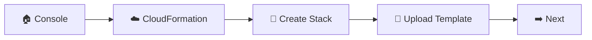
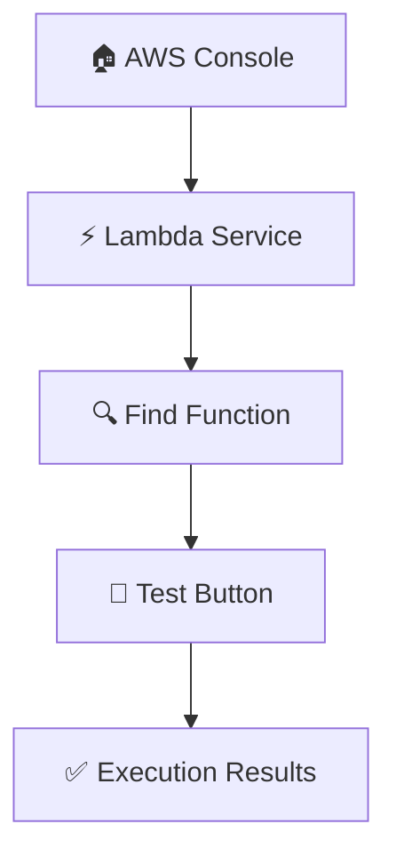
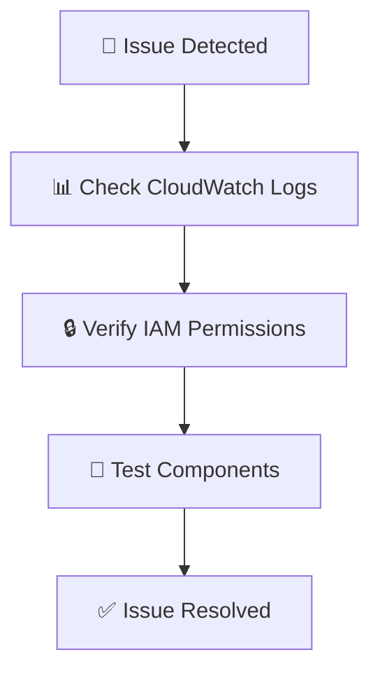
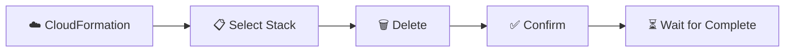
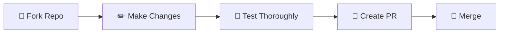

<div align="center">

# 🔍 AWS Resource Audit Automation


### 🚀 Automated detection of idle, unoptimized, or cost-inefficient AWS resources

*Comprehensive resource scanning • Scheduled execution • Beautiful HTML reports • Email notifications*

</div>

---

## ✨ Features

<table>
<tr>
<td width="50%">

### 🎯 **Comprehensive Scanning**
- 🖥️ EC2 instances analysis
- 💾 EBS volumes monitoring  
- 🪣 S3 buckets optimization
- 🗄️ RDS instances & snapshots
- ⚡ Lambda functions audit
- ⚖️ Load Balancers inspection

</td>
<td width="50%">

### 🤖 **Smart Automation**
- ⏰ EventBridge scheduled execution
- 📊 Beautiful HTML reports
- 📧 SNS email notifications
- 💰 Cost optimization focus
- 🔒 Secure presigned URLs
- 📈 CloudWatch integration

</td>
</tr>
</table>

---

## 🔧 Prerequisites

### 1. 🏢 AWS Account Requirements

<div style="background: linear-gradient(90deg, #667eea 0%, #764ba2 100%); padding: 20px; border-radius: 10px; color: white; margin: 10px 0;">

**🔑 Required Permissions:**
- `cloudformation:*` - Deploy the stack
- `iam:CreateRole`, `iam:AttachRolePolicy`, `iam:PassRole` - IAM management
- `lambda:*` - Lambda functions
- `s3:*` - S3 bucket operations
- `sns:*` - Email notifications
- `events:*` - Scheduled execution

</div>

### 2. 🪣 S3 Bucket Setup

> 🎯 **Important**: Create an S3 bucket **before** deployment!

```bash
# Example: Create S3 bucket
aws s3 mb s3://my-company-audit-reports-2024 --region us-east-1
```

**📋 Checklist:**
- ✅ Bucket created in target region
- ✅ Globally unique bucket name
- ✅ Appropriate permissions configured

### 3. 📧 Email Configuration

- 📨 Valid email address for notifications
- 📬 Access to confirm SNS subscription

### 4. 🛠️ Tools & Software

<table>
<tr>
<td align="center"></td>
<td align="center"></td>
<td align="center"></td>
</tr>
<tr>
<td align="center">AWS CLI configured</td>
<td align="center">Git (optional)</td>
<td align="center">AWS Console access</td>
</tr>
</table>

### 5. 🌍 Regional Considerations

<div style="background: #f0f9ff; border: 2px solid #0ea5e9; border-radius: 8px; padding: 15px; margin: 10px 0;">

**🎯 Single Region Scanning**
- Deploy stack in region to audit
- For multi-region: deploy separate stacks
- Resources scanned in deployment region only

</div>

---

## 🚀 Deployment Instructions

<div align="center">
<h3>Choose Your Adventure! 🎮</h3>
</div>

<table>
<tr>
<td width="50%" align="center">

### 🖱️ Option 1: AWS Console
**👶 Beginner Friendly**

Perfect for first-time users and visual learners

[Jump to Console Guide ⬇️](#-option-1-aws-management-console-recommended-for-beginners)

</td>
<td width="50%" align="center">

### ⌨️ Option 2: AWS CLI  
**🚀 Advanced Users**

Command-line power users and automation

[Jump to CLI Guide ⬇️](#-option-2-aws-cli-advanced-users)

</td>
</tr>
</table>

### 🖱️ Option 1: AWS Management Console (Recommended for Beginners)

#### 📋 Step 1: Prepare Your Environment

<div style="background: #ecfdf5; border: 2px solid #10b981; border-radius: 8px; padding: 15px; margin: 10px 0;">

1. 🔐 **Sign in** to AWS Management Console
2. 🪣 **Verify** S3 bucket exists
3. 🌍 **Navigate** to target region

</div>

#### 🏗️ Step 2: Deploy the CloudFormation Stack



**Detailed Steps:**
1. Navigate to **CloudFormation** service
2. Click **"Create stack"** → **"With new resources (standard)"**
3. In **"Specify template"** section:
   - 📁 Select **"Upload a template file"**
   - 📎 Click **"Choose file"** and upload `aws-resource-audit-template.yaml`
   - ➡️ Click **"Next"**

#### ⚙️ Step 3: Configure Stack Parameters

<div style="background: #fef3c7; border: 2px solid #f59e0b; border-radius: 8px; padding: 15px; margin: 10px 0;">

**🎯 Required Parameters:**

| Parameter | Example | Description |
|-----------|---------|-------------|
| 🏷️ **Stack name** | `aws-resource-audit-prod` | Descriptive stack identifier |
| 🪣 **S3BucketName** | `my-company-audit-reports` | Your existing S3 bucket |
| 📁 **ReportsPrefix** | `reports` | Directory within bucket |
| 📧 **EmailAddress** | `admin@company.com` | Notification email |
| 🌍 **TargetRegion** | Leave empty or `us-east-1` | Region to audit |
| ⏰ **ScheduleExpression** | `rate(7 days)` | Execution frequency |

</div>

#### 🔧 Step 4: Configure Stack Options

<table>
<tr>
<td>🏷️ **Tags**</td>
<td>Optional - Add for resource management</td>
</tr>
<tr>
<td>🔒 **Permissions**</td>
<td>Leave as default</td>
</tr>
<tr>
<td>🔄 **Stack failure**</td>
<td>Choose "Roll back all stack resources"</td>
</tr>
</table>

#### ✅ Step 5: Review and Deploy

<div style="background: #fee2e2; border: 2px solid #ef4444; border-radius: 8px; padding: 15px; margin: 10px 0;">

**⚠️ IMPORTANT:** 
Check **"I acknowledge that AWS CloudFormation might create IAM resources"**

</div>

🚀 Click **"Create stack"** and wait for **"CREATE_COMPLETE"** status (2-5 minutes)

### ⌨️ Option 2: AWS CLI (Advanced Users)

#### 🔍 Step 1: Validate Template

```bash
# 📁 Navigate to template directory
cd /path/to/cloudformation/template

# ✅ Verify template syntax
aws cloudformation validate-template \
    --template-body file://aws-resource-audit-template.yaml
```

#### 🚀 Step 2: Deploy the Stack

```bash
aws cloudformation create-stack \
  --stack-name aws-resource-audit \
  --template-body file://aws-resource-audit-template.yaml \
  --parameters \
    ParameterKey=S3BucketName,ParameterValue=your-existing-bucket-name \
    ParameterKey=ReportsPrefix,ParameterValue=reports \
    ParameterKey=EmailAddress,ParameterValue=your.email@example.com \
    ParameterKey=TargetRegion,ParameterValue=us-east-1 \
    ParameterKey=ScheduleExpression,ParameterValue="rate(7 days)" \
  --capabilities CAPABILITY_IAM \
  --region us-east-1
```

#### 📊 Step 3: Monitor Deployment

```bash
# 📈 Check stack status
aws cloudformation describe-stacks \
    --stack-name aws-resource-audit \
    --query 'Stacks[0].StackStatus'

# 📋 Monitor stack events
aws cloudformation describe-stack-events \
    --stack-name aws-resource-audit
```

---

## 🎉 Post-Deployment Setup

### 📧 Step 1: Confirm SNS Subscription

<div style="background: #f0f9ff; border: 2px solid #3b82f6; border-radius: 8px; padding: 15px; margin: 10px 0;">

1. 📨 Check email for **"AWS Notification - Subscription Confirmation"**
2. 🔗 Click **"Confirm subscription"** link
3. ✅ Verify confirmation page loads

</div>

### 🧪 Step 2: Test the Lambda Function



**Detailed Steps:**
1. Navigate to **Lambda** service
2. Find function: `aws-resource-audit-ResourceAuditFunction-XXXXXXXXXXXX`
3. Click **"Test"** button
4. Use default test event `{}`
5. Review **Execution results**

### 📊 Step 3: Verify Report Generation

<table>
<tr>
<td width="30%">🪣 **Navigate to S3**</td>
<td width="70%">Open your specified bucket</td>
</tr>
<tr>
<td>📁 **Find reports folder**</td>
<td>Look for your configured prefix directory</td>
</tr>
<tr>
<td>📄 **Download HTML**</td>
<td>File format: `aws_audit_report_YYYYMMDD_HHMMSS.html`</td>
</tr>
<tr>
<td>🌐 **Open in browser**</td>
<td>View the comprehensive audit report</td>
</tr>
</table>

### ⏰ Step 4: Verify Scheduled Execution

✅ EventBridge rule automatically created  
✅ Default schedule: every 7 days  
✅ Check **EventBridge** → **Rules** to confirm

---

## 📊 Understanding the Audit Results

<div align="center">
<h3>🎯 Comprehensive Resource Analysis</h3>
</div>

### 🔍 Report Sections

<table>
<tr>
<td align="center">💰</td>
<td><strong>Budget Alerts Check</strong></td>
<td>Verifies AWS Budgets configuration</td>
</tr>
<tr>
<td align="center">🏷️</td>
<td><strong>Untagged Resources Check</strong></td>
<td>Identifies untagged resources</td>
</tr>
<tr>
<td align="center">🛌</td>
<td><strong>Idle EC2 Resources Check</strong></td>
<td>Finds low CPU utilization instances</td>
</tr>
<tr>
<td align="center">♻️</td>
<td><strong>S3 Lifecycle Policies Check</strong></td>
<td>Reviews S3 lifecycle management</td>
</tr>
<tr>
<td align="center">📅</td>
<td><strong>Old RDS Snapshots Check</strong></td>
<td>Identifies snapshots >30 days old</td>
</tr>
<tr>
<td align="center">🧹</td>
<td><strong>Forgotten EBS Volumes Check</strong></td>
<td>Finds unattached volumes</td>
</tr>
<tr>
<td align="center">🌐</td>
<td><strong>Data Transfer Risks Check</strong></td>
<td>Analyzes network cost optimization</td>
</tr>
<tr>
<td align="center">💸</td>
<td><strong>On-Demand EC2 Instances</strong></td>
<td>Reserved Instance opportunities</td>
</tr>
<tr>
<td align="center">🛑</td>
<td><strong>Idle Load Balancers Check</strong></td>
<td>Finds load balancers with no traffic</td>
</tr>
<tr>
<td align="center">🌍</td>
<td><strong>Route 53 Records Check</strong></td>
<td>Reviews DNS configuration</td>
</tr>
<tr>
<td align="center">☸️</td>
<td><strong>EKS Clusters Check</strong></td>
<td>Audits Kubernetes clusters</td>
</tr>
<tr>
<td align="center">🔐</td>
<td><strong>IAM Usage Check</strong></td>
<td>Reviews users, roles, policies</td>
</tr>
<tr>
<td align="center">🛡️</td>
<td><strong>Security Groups Check</strong></td>
<td>Identifies overly permissive rules</td>
</tr>
</table>

### 🚦 Status Indicators

<div style="display: flex; justify-content: space-around; margin: 20px 0;">
<div style="background: #dcfce7; border: 2px solid #16a34a; border-radius: 8px; padding: 15px; text-align: center; width: 30%;">
<h4>✅ Green</h4>
Optimal configuration<br/>
No action needed
</div>
<div style="background: #fef3c7; border: 2px solid #f59e0b; border-radius: 8px; padding: 15px; text-align: center; width: 30%;">
<h4>⚠️ Yellow</h4>
Cost optimization<br/>
opportunity
</div>
<div style="background: #fee2e2; border: 2px solid #ef4444; border-radius: 8px; padding: 15px; text-align: center; width: 30%;">
<h4>❌ Red</h4>
Issue requiring<br/>
attention
</div>
</div>

---

## ⚙️ Customization Options

### ⏰ Modifying the Schedule

```bash
# 🔄 Update execution frequency
aws cloudformation update-stack \
  --stack-name aws-resource-audit \
  --template-body file://aws-resource-audit-template.yaml \
  --parameters \
    ParameterKey=ScheduleExpression,ParameterValue="rate(1 day)" \
  --capabilities CAPABILITY_IAM
```

### 🎛️ Schedule Expression Examples

| Expression | Frequency | Use Case |
|------------|-----------|----------|
| `rate(1 day)` | Daily | 🔥 High-change environments |
| `rate(3 days)` | Every 3 days | 📊 Regular monitoring |
| `rate(7 days)` | Weekly | 📈 Standard auditing |
| `cron(0 9 ? * MON *)` | Every Monday 9 AM | 📅 Weekly business reports |

### 🔧 Adjusting Thresholds

Edit the Lambda function code in the CloudFormation template to modify:
- 📊 CPU utilization threshold (default: 10%)
- 📅 RDS snapshot age (default: 30 days)
- 🔍 CloudWatch monitoring period

---

## 🐛 Troubleshooting

<div align="center">
<h3>🔧 Common Issues & Solutions</h3>
</div>

### 🚨 Issue 1: Stack Creation Fails

<div style="background: #fee2e2; border: 2px solid #ef4444; border-radius: 8px; padding: 15px; margin: 10px 0;">

**❌ Error:** "User is not authorized to perform: iam:CreateRole"

**✅ Solution:** Ensure your AWS user/role has necessary IAM permissions

</div>

### ⏱️ Issue 2: Lambda Function Timeout

<div style="background: #fee2e2; border: 2px solid #ef4444; border-radius: 8px; padding: 15px; margin: 10px 0;">

**❌ Error:** "Task timed out after 300.00 seconds"

**✅ Solution:** Increase timeout value in CloudFormation template

</div>

### 🚫 Issue 3: S3 Access Denied

<div style="background: #fee2e2; border: 2px solid #ef4444; border-radius: 8px; padding: 15px; margin: 10px 0;">

**❌ Error:** "Access Denied" when uploading reports

**✅ Solution:** 
- Verify S3 bucket exists
- Check Lambda execution role permissions
- Ensure bucket is in same region

</div>

### 📧 Issue 4: No Email Notifications

<div style="background: #fef3c7; border: 2px solid #f59e0b; border-radius: 8px; padding: 15px; margin: 10px 0;">

**⚠️ Problem:** Reports generate but no emails received

**✅ Solutions:**
- 📬 Check spam/junk folder
- ✅ Verify SNS subscription confirmation
- 📊 Check CloudWatch Logs

</div>

### 📈 Debugging Steps



1. **📊 CloudWatch Logs**: `/aws/lambda/aws-resource-audit-ResourceAuditFunction-XXXX`
2. **🔒 IAM Verification**: Check `ReadOnlyAccess` policy attachment
3. **🧪 Component Testing**: Manual Lambda invocation, S3 permissions, SNS verification

---

## 💰 Cost Considerations

### 📊 Estimated Monthly Costs (US East 1)

<table>
<tr style="background: #f8fafc;">
<th>🏷️ Service</th>
<th>💵 Cost</th>
<th>📝 Notes</th>
</tr>
<tr>
<td>⚡ **Lambda**</td>
<td>~$0.05</td>
<td>Weekly execution, 5-min runtime</td>
</tr>
<tr>
<td>📊 **CloudWatch Logs**</td>
<td>~$0.01</td>
<td>Log retention and storage</td>
</tr>
<tr>
<td>📧 **SNS**</td>
<td>~$0.01</td>
<td>Email notifications</td>
</tr>
<tr>
<td>⏰ **EventBridge**</td>
<td>$0.00</td>
<td>No additional cost</td>
</tr>
<tr>
<td>🪣 **S3 Storage**</td>
<td>Variable</td>
<td>Based on report size/retention</td>
</tr>
<tr style="background: #dcfce7; font-weight: bold;">
<td>📈 **Total**</td>
<td>~$0.07/month</td>
<td>Incredible ROI for cost savings!</td>
</tr>
</table>

### 💡 Cost Optimization Tips

<div style="background: #f0f9ff; border: 2px solid #3b82f6; border-radius: 8px; padding: 15px; margin: 10px 0;">

- 🗂️ **Archive old reports** using S3 lifecycle policies
- ⏰ **Adjust schedule** frequency based on needs
- 📦 **Use S3 Intelligent Tiering** for long-term storage
- 🔄 **Optimize Lambda memory** allocation for performance

</div>

---

## 🔒 Security Best Practices

### 🛡️ Data Protection

<table>
<tr>
<td>🔐 **Encryption**</td>
<td>Consider AWS KMS for S3 bucket encryption</td>
</tr>
<tr>
<td>🏗️ **Bucket Policies**</td>
<td>Implement restrictive access policies</td>
</tr>
<tr>
<td>📊 **Report Sensitivity**</td>
<td>Reports contain infrastructure information</td>
</tr>
</table>

### 👤 Access Control

- 🔍 **Regular IAM review** - Audit permissions quarterly
- 🎯 **Least privilege** - Grant minimal required access
- 📋 **CloudTrail monitoring** - Track function execution

---

## 🧹 Cleanup Instructions

<div align="center">
<h3>🗑️ Clean Removal Process</h3>
</div>

### 🖱️ Option 1: AWS Console



### ⌨️ Option 2: AWS CLI

```bash
# 🗑️ Delete the entire stack
aws cloudformation delete-stack --stack-name aws-resource-audit

# 📊 Monitor deletion progress
aws cloudformation describe-stacks --stack-name aws-resource-audit
```

### ⚠️ Manual Cleanup Required

<div style="background: #fef3c7; border: 2px solid #f59e0b; border-radius: 8px; padding: 15px; margin: 10px 0;">

**🚨 Not Automatically Deleted:**
- 🪣 **S3 bucket and reports** - Manual deletion required
- 📊 **CloudWatch Logs** - Retained by default

</div>

---

## 🤝 Support and Contributions

### 🆘 Getting Help

<div style="background: #f0f9ff; border: 2px solid #3b82f6; border-radius: 8px; padding: 15px; margin: 10px 0;">

1. 📚 **Check troubleshooting** section above
2. 📊 **Review CloudWatch Logs** for detailed errors
3. 📖 **Consult AWS documentation** for service-specific issues
4. 💬 **Open GitHub issue** for project-specific problems

</div>

### 🚀 Contributing



**Contribution Guidelines:**
1. 🍴 Fork the repository
2. ✏️ Make improvements to template/documentation
3. 🧪 Test in development environment
4. 📝 Submit pull request with detailed description

---

<div align="center">

## 📄 License

This project is licensed under the **MIT License** - see the LICENSE file for details.

## 🙏 Acknowledgments

<div style="background: linear-gradient(90deg, #667eea 0%, #764ba2 100%); padding: 20px; border-radius: 10px; color: white; margin: 20px 0;">

This project was inspired by shell scripts for identifying idle AWS resources and enhanced with:
- 🤖 **Automated deployment capabilities**
- 📊 **Beautiful HTML reporting**
- 📧 **Email notification system**
- ☁️ **CloudFormation infrastructure as code**

</div>

---

### 🌟 Star this project if it helped you save money on AWS! 


</div>
