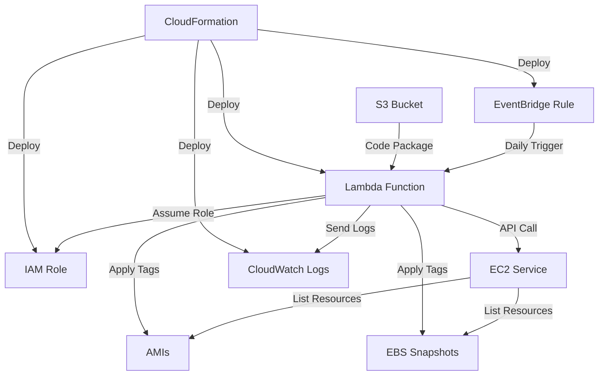

# EC2 Snapshot Automation - Architecture & Workflow

## 🏗️ Architecture Overview

This solution implements an automated tagging system for EC2 AMIs and EBS snapshots using serverless AWS services. The architecture follows AWS best practices for cost optimization, security, and operational excellence.

## 🔄 Detailed Workflow

### Phase 1: Infrastructure Deployment
```
CloudFormation Stack Deployment
├── IAM Role Creation (TagEC2BackupsLambdaRole)
├── CloudWatch Log Group (/aws/lambda/TagEC2Backups)
├── Lambda Function (TagEC2Backups)
├── EventBridge Rule (DailyEC2BackupTagger)
└── Lambda Permission (EventBridge → Lambda)
```

### Phase 2: Runtime Execution Flow

#### Step 1: Scheduled Trigger
- **Component**: Amazon EventBridge
- **Trigger**: `rate(1 day)` - Daily execution
- **Action**: Invokes Lambda function with empty payload
- **Time**: Configurable (default: UTC time)

#### Step 2: Lambda Initialization
- **Component**: AWS Lambda
- **Runtime**: Python 3.12
- **Memory**: 128 MB
- **Timeout**: 300 seconds (5 minutes)
- **Environment Variables**:
  - `RETENTION_DAYS`: "90" (configurable)

#### Step 3: IAM Role Assumption
- **Component**: AWS IAM
- **Role**: `TagEC2BackupsLambdaRole-{Region}`
- **Permissions**:
  ```json
  {
    "EC2": [
      "DescribeImages",
      "DescribeSnapshots", 
      "CreateTags"
    ],
    "CloudWatch": [
      "CreateLogGroup",
      "CreateLogStream",
      "PutLogEvents"
    ]
  }
  ```

#### Step 4: Resource Discovery
- **Component**: Amazon EC2 API
- **Actions**:
  1. `describe_images(Owners=['self'])` - Get owned AMIs
  2. `describe_snapshots(OwnerIds=['self'])` - Get owned snapshots
- **Filters**: Only resources owned by the current account
- **Scope**: Current AWS region only

#### Step 5: Date Calculation
- **Logic**: Python datetime calculations
- **Variables**:
  - `today = datetime.date.today()`
  - `delete_on = today + timedelta(days=RETENTION_DAYS)`
  - `formatted_delete_on = delete_on.strftime('%Y-%m-%d')`

#### Step 6: Resource Tagging
- **Component**: EC2 CreateTags API
- **Tags Applied**:
  ```json
  [
    {
      "Key": "Retention",
      "Value": "90days"
    },
    {
      "Key": "DeleteOn", 
      "Value": "2025-04-06"
    }
  ]
  ```
- **Error Handling**: Individual resource failures don't stop execution
- **Logging**: Each successful/failed tagging operation is logged

#### Step 7: Monitoring & Logging
- **Component**: Amazon CloudWatch
- **Log Group**: `/aws/lambda/TagEC2Backups`
- **Retention**: 14 days
- **Metrics**:
  - Execution count
  - Duration
  - Error rate
  - Memory utilization

#### Step 8: Response Generation
- **Success Response**:
  ```json
  {
    "statusCode": 200,
    "message": "Successfully tagged X AMIs and Y snapshots",
    "amis_tagged": 5,
    "snapshots_tagged": 12,
    "retention_days": 90,
    "delete_on": "2025-04-06"
  }
  ```
- **Error Response**:
  ```json
  {
    "statusCode": 500,
    "message": "Error in lambda execution: {error_details}"
  }
  ```

## 🔧 Architecture Components

### 1. EventBridge Rule
- **Purpose**: Serverless cron scheduler
- **Configuration**: Daily execution with rate expression
- **Benefits**: 
  - No EC2 instances required
  - Highly available
  - Cost-effective
  - Managed service

### 2. Lambda Function
- **Purpose**: Execute tagging logic
- **Code Location**: S3 bucket (demo-terra22062025)
- **Handler**: `tag_ami_snapshot.lambda_handler`
- **Benefits**:
  - Pay-per-execution model
  - Automatic scaling
  - No server management
  - Built-in monitoring

### 3. IAM Role
- **Purpose**: Security and access control
- **Principle**: Least privilege access
- **Scope**: Region-specific to avoid conflicts
- **Benefits**:
  - Secure execution environment
  - Auditable permissions
  - Cross-service access control

### 4. CloudWatch Logs
- **Purpose**: Centralized logging and monitoring
- **Configuration**: 14-day retention
- **Benefits**:
  - Real-time log streaming
  - Search and filter capabilities
  - Integration with CloudWatch Alarms
  - Cost optimization with retention policies

### 5. S3 Bucket
- **Purpose**: Lambda deployment package storage
- **Content**: `tag-ec2-backup.zip` containing Python code
- **Benefits**:
  - Versioning support
  - High durability (99.999999999%)
  - Cost-effective storage

## 🔄 Data Flow



## 🎯 Key Benefits

### Cost Optimization
- **Serverless Architecture**: Pay only for execution time
- **Efficient Resource Management**: Automated lifecycle management
- **Log Retention**: 14-day retention prevents excessive storage costs

### Security
- **Least Privilege**: IAM role with minimal required permissions
- **Account Isolation**: Only processes owned resources
- **Audit Trail**: Complete logging of all operations

### Reliability
- **Error Handling**: Graceful failure handling for individual resources
- **Monitoring**: CloudWatch integration for operational visibility
- **Idempotent**: Safe to run multiple times without side effects

### Scalability
- **Auto-scaling**: Lambda automatically handles concurrent executions
- **Regional Deployment**: Can be deployed across multiple regions
- **Resource Agnostic**: Works regardless of AMI/snapshot count

## 📊 Operational Metrics

### Success Metrics
- Number of AMIs tagged per execution
- Number of snapshots tagged per execution
- Execution duration (typically < 30 seconds)
- Error rate (should be < 1%)

### Monitoring Alerts (Recommended)
1. **Function Errors**: Alert on execution failures
2. **Duration**: Alert if execution time > 60 seconds
3. **No Executions**: Alert if function hasn't run in 25 hours
4. **High Error Rate**: Alert if error rate > 5%

## 🔄 Workflow Customization

### Schedule Modification
```yaml
# Every 12 hours
ScheduleExpression: 'rate(12 hours)'

# Daily at 2 AM UTC
ScheduleExpression: 'cron(0 2 * * ? *)'

# Weekly on Sundays at midnight
ScheduleExpression: 'cron(0 0 ? * SUN *)'
```

### Retention Period Adjustment
```yaml
Environment:
  Variables:
    RETENTION_DAYS: "30"    # 30 days retention
    RETENTION_DAYS: "180"   # 6 months retention
```

### Additional Tag Customization
```python
# Add custom tags in the Lambda function
additional_tags = [
    {'Key': 'Environment', 'Value': 'production'},
    {'Key': 'Owner', 'Value': 'infrastructure-team'},
    {'Key': 'CostCenter', 'Value': 'IT-Operations'}
]
```

This architecture provides a robust, scalable, and cost-effective solution for automated EC2 resource lifecycle management.
